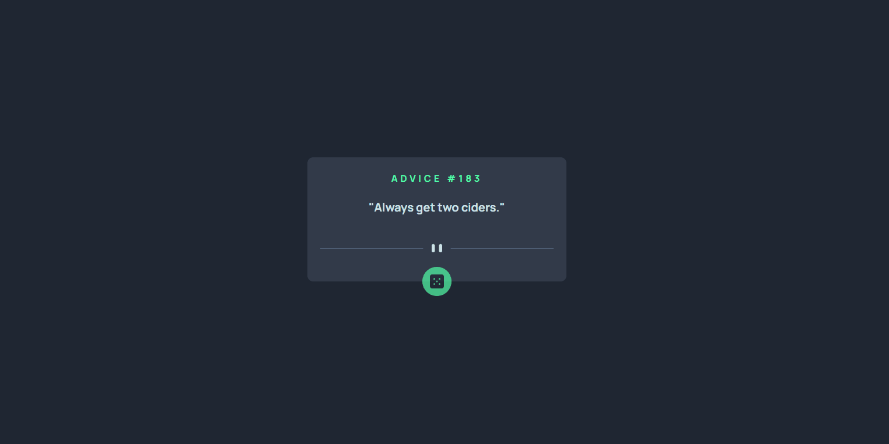

# Frontend Mentor - Advice generator app

- No desafio do Frontend Mentor, desenvolvi um Aplicativo Gerador de Conselhos, que exibe frases motivacionais aleatórias. Esse projeto foi uma ótima oportunidade para praticar habilidades de front-end e consumir APIs. Vou explicar como ele foi feito:

# Como foi desenvolvido:

1. Estrutura do HTML:
Criei a base do aplicativo com uma estrutura simples.  

### O conteúdo principal inclui:
- Um título e o id do conselho.
- Uma área onde o conselho é exibido.
- Um botão para gerar novos conselhos.

2. Estilo com CSS:  
Utilizei o CSS para estilizar o aplicativo, garantindo uma aparência limpa e responsiva. Adicionei detalhes visuais, como:

- Centralização do conteúdo.
- Bordas arredondadas para o botão.
- Um efeito de hover no botão para torná-lo mais interativo.

 
3. Lógica em JavaScript:

- Fiz uma requisição à Advice Slip API usando a função fetch().
- Essa API fornece frases aleatórias em formato JSON.
- Adicionei um evento ao botão que, ao ser clicado, busca um novo conselho na API e o exibe no aplicativo.
- Usei manipulação do DOM para atualizar o id e o texto dinamicamente sem recarregar a página.

4. Efeitos interativos:
Para melhorar a experiência do usuário, implementei animações simples:

- O conselho aparece suavemente quando atualizado.
- O botão tem uma leve transição ao ser clicado, tornando a interação mais fluida.

5. Por que esse projeto é interessante?
Esse aplicativo é simples, mas envolve conceitos fundamentais de desenvolvimento front-end, como:

- Consumo de APIs com JavaScript.
- Manipulação do DOM para alterar conteúdo.
- Criação de uma interface visualmente atraente e responsiva.

## Veja como ficou o projeto final 

<a href="https://leandroazevedo-1.github.io/Advice-generator-app/#" target="_blank">Clique aqui.
    
</a>